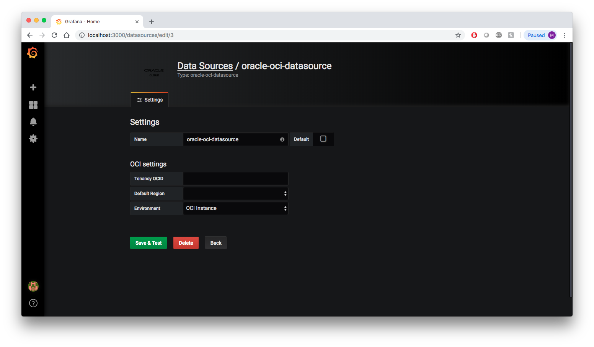

# OCI Virtual Machine Installation - Oracle Cloud Infrastructure Data Source for Grafana   

## Background

Grafana is a popular technology that makes it easy to visualize metrics. The Oracle Cloud Infrastructure Data Source for Grafana is used to extend Grafana by adding OCI as a data source. The plugin enables you to visualize metrics related to a number of OCI resources: Compute, Networking, Storage, and custom metrics. 

This walkthrough is intended for use by people who would like to deploy Grafana and the OCI Data Source for Grafana on a virtual machine in OCI. 

Make sure you have access to the [Monitoring Service](https://docs.cloud.oracle.com/iaas/Content/Monitoring/Concepts/monitoringoverview.htm) and that [metrics have been enabled](https://docs.cloud.oracle.com/iaas/Content/Compute/Tasks/enablingmonitoring.htm) for the resources you are trying to monitor.

## Create the Grafana Environment in OCI 

Provision an Oracle Linux [virtual machine](https://docs.cloud.oracle.com/iaas/Content/Compute/Concepts/computeoverview.htm) in OCI connected to a [Virtual Cloud Network](https://docs.cloud.oracle.com/iaas/Content/Network/Tasks/managingVCNs.htm) with access to the public internet. If you do not already have access to a Virtual Cloud Network with access to the public internet you can navigate to **Virtual Cloud Networks** under **Networking** and click **Create Virtual Cloud Network**. Choosing the `CREATE VIRTUAL CLOUD NETWORK PLUS RELATED RESOURCES` option will result in a VCN with an Internet Routing Gateway and Route Tables configured for access to the public internet. Three subnets will be created: one in each availability domain in the region.

After creating your VM, the next step is to create a [dynamic group](https://docs.cloud.oracle.com/iaas/Content/Identity/Tasks/managingdynamicgroups.htm) used to group virtual machine or bare metal compute instances as “principals” (similar to user groups). 

   

Next, create a [policy](https://docs.cloud.oracle.com/iaas/Content/Identity/Concepts/policygetstarted.htm) named “grafana_policy” in the root compartment of your tenancy to permit instances in the dynamic group to make API calls against Oracle Cloud Infrastructure services. Add the following policy statements:

* `allow dynamicgroup grafana to read metrics in tenancy`
* `allow dynamicgroup grafana to read compartments in tenancy`

   

## Install Grafana and the OCI Data Source for Grafana Plugin 

To [install the data source](https://grafana.com/plugins/oci-datasource/installation) make sure you are running [Grafana 3.0](https://grafana.com/get) or later. Use the [grafana-cli tool](http://docs.grafana.org/plugins/installation/) to install the Oracle Cloud Infrastructure Data Source for Grafana from the command line:

```
grafana-cli plugins install oci-datasource
```
**NOTE** Today the latest version of the plugin is available only with the manual installation

The plugin will be installed into your Grafana plugins directory, which by default is located at /var/lib/grafana/plugins. [Here is more information on the CLI tool](http://docs.grafana.org/plugins/installation/).

### Manually installation 
Alternatively, you can manually download the .tar file and unpack it into your /grafana/plugins directory. To do so, change to the Grafana plugins directory: `cd /usr/local/var/lib/grafana/plugins`. Download the OCI Grafana Plugin: wget `https://github.com/oracle/oci-grafana-plugin/releases/download/V1.1.1/plugin.tar`. Create a directory and install the plugin: `mkdir oci && tar -C oci -xvf plugin.tar` and then remove the tarball: `rm plugin.tar`. 

>  **Additional step for Grafana 7**. Open the grafana configuration  *grafana.ini* file and add the `allow_loading_unsigned_plugins = "oci-datasource"`in the *plugins* section.

*Example* 
```
    [plugins]
    ;enable_alpha = false
    ;app_tls_skip_verify_insecure = false
    allow_loading_unsigned_plugins = "oci-datasource"
```

To start the Grafana server, run: `sudo systemctl start grafana-server`. 


## Configure Grafana

The next step is to configure the plugin. To find the IP address of the newly-created instance, navigate to Compute > Instances > [Your Instance]. The Public IP address is listed under the Primary VNIC Information section. Connect to Grafana via port forward by running `ssh opc@[Instance Public IP] -L 3000:localhost:3000`. 

Navigate to the Grafana homepage at http://localhost:3000.


Log in with the default username `admin` and the password `admin`. You will be prompted to change your password. Click **Skip** or **Save** to continue. 

On the Home Dashboard click the gear icon on the left side of the page.


Click **Add data source**.


 Choose **oracle-oci-datasource** as your data source type.


Fill in your **Tenancy OCID**, **Default Region**, and **Environment**. Your **Default region** is the same as your home region listed in the **Tenancy Details** page. For **Environment** choose **OCI Instance**. 

Click **Save & Test** to return to the home dashboard.



## Next Steps

Check out how to use the newly installed and configured plugin in our [Using Grafana with Oracle Cloud Infrastructure Data Source](using.md) walkthrough. 
